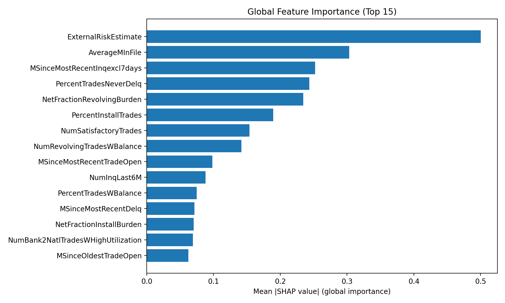

# credit-risk-fico-heloc

## Global Explainability (SHAP)

We compute global feature importance using mean absolute SHAP values.

- CSV: `reports/global_shap.csv`
- Plot: `reports/global_shap_top15.png`

> Note: Global SHAP shows overall importance across many samples, while the API returns *local* SHAP explanations for a single prediction.

